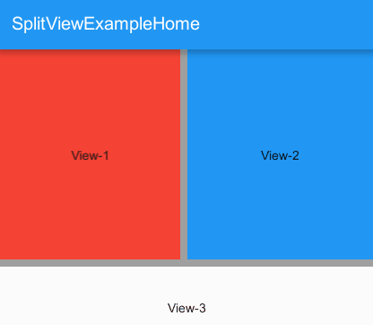

# UIWidgets.AddOns
 Add-On packages for Unity UIWidgets 
 
 ## Requirements
 * Unity 2019.3.15f1 (I tried)
 * UIWidgets 1.5.4  [Unity Asset Store](https://assetstore.unity.com/packages/tools/gui/uiwidgets-146398) | [GitHub](https://github.com/UnityTech/UIWidgets/releases)
 
 
## Contains
 
### 1. Split View
* based on flutter extension [split_view 1.0.1](https://pub.dev/packages/split_view/).

    
 
 
 ## License 
 * MIT License
 