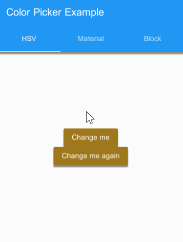
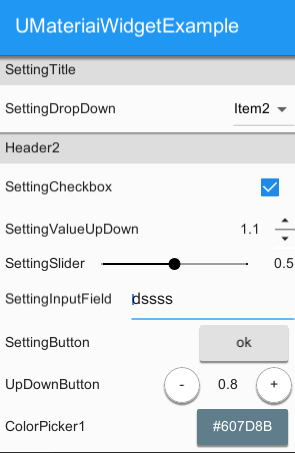
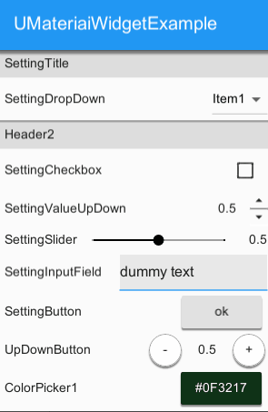
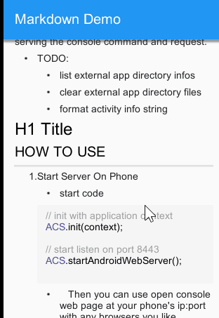

# UIWidgets.AddOns
 Add-On packages for Unity [UIWidgets](https://github.com/UnityTech/UIWidgets)
 
 ## Requirements
 * Unity 2019.3.15f1 / Unity2019.4.16f1 (I tried)
 * UIWidgets 1.5.4  [Unity Asset Store](https://assetstore.unity.com/packages/tools/gui/uiwidgets-146398) | [GitHub](https://github.com/UnityTech/UIWidgets/releases)
 
 
## Contains
 
### 1. Split View
* based on flutter extension [split_view 1.0.1](https://pub.dev/packages/split_view/).

    
 
 ### 2. Color Picker
* based on flutter extension [flutter_colorpicker 0.3.4](https://pub.dev/packages/flutter_colorpicker/).

    
 
### 3. Useful Setting panel components
* Widget componetns for settng menu/form.
 - Dropdown
 - Checkbox
 - Value Up/Down (2 types)
 - Value Slider
 - Text input filed
 - Button
 - Color picker (3 types)
 
      
     

### 4. Markdown render

* based on [Markdown-Renderer-For-UIWidgets](https://github.com/suntabu/Markdown-Renderer-For-UIWidgets/) by [suntabu](https://github.com/suntabu).

     
* Example

    ```cs
    protected override Widget createWidget()
    {
        var title = "Markdown Demo";
        return new MaterialApp(
            title: title,
            showPerformanceOverlay: false,
            home: new Scaffold(
                appBar: new AppBar(
                    title: new Text(title)
                ),//AppBar
                body: new Markdown(
                    key: null,
                    data: (string) markdownText,
                    syntaxHighlighter: new DartSyntaxHighlighter(SyntaxHighlighterStyle.lightThemeStyle()),
                    onTapLink: url => { Application.OpenURL(url); }
                )//Markdown
            )//Scaffold
        );
    }
    ```

 ## License 
 * MIT License
 